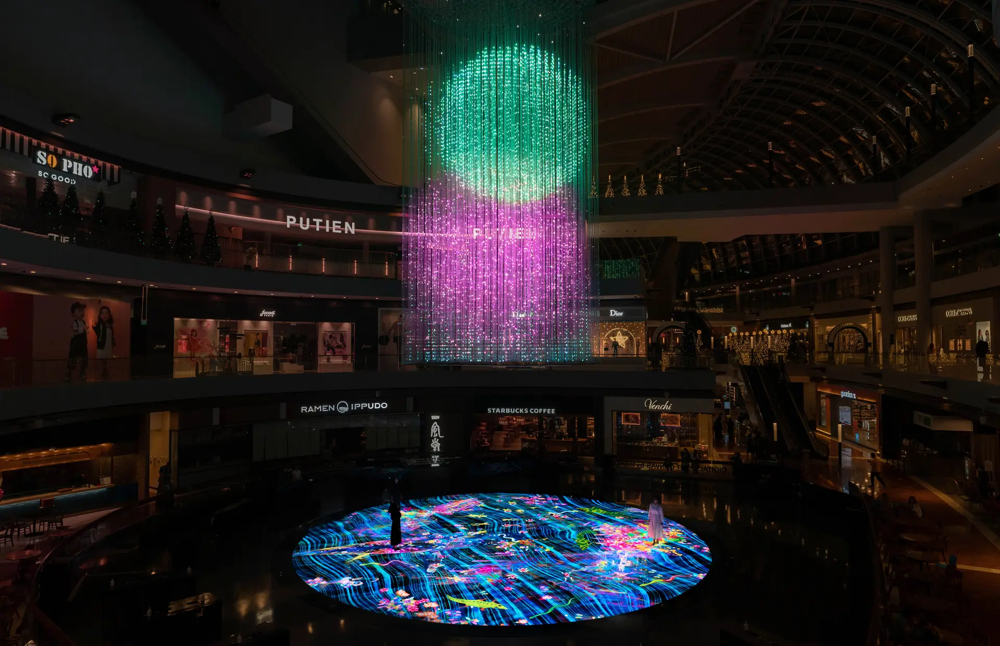
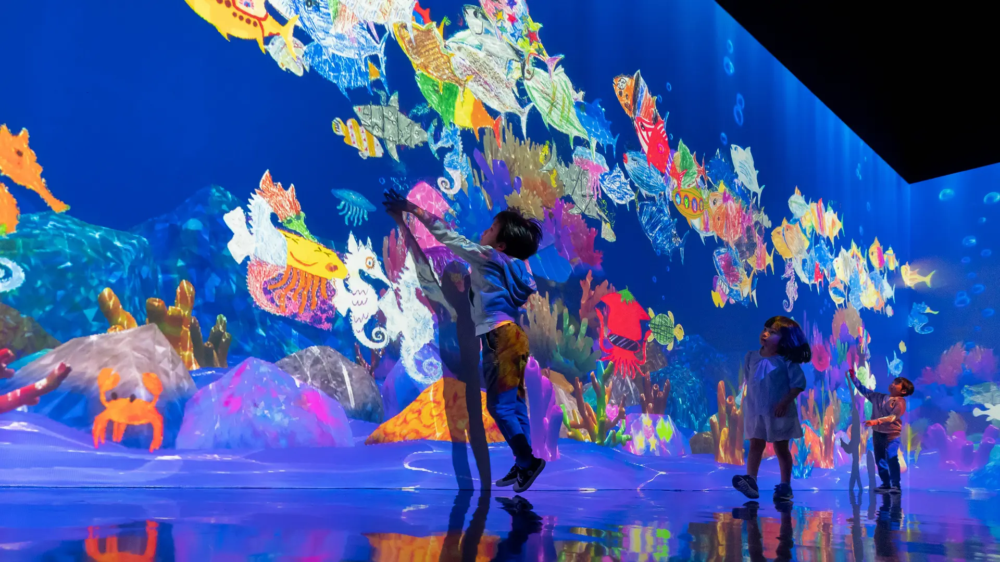

# suli0089_9103_tut1_major-project
## IDEA9103 Creative Coding Major Project
## Instructions on interacting with the artwork

1. Interact with the artwork with your mouse by **dragging the large circle patterns** around the canvas
    - The selected circle pattern will rotate and change colour when being dragged 
2. Press **"1"** on keyboard to animate the background beads
    - The background beads will move on its own at a constant speed until "1" is pressed again

## Animating the group code

### Animation method
The method used to animate this artwork is through **user input**. It uses both mouse and keyboard interactions to animate different elements of the artwork. I chose this method because it allows users to create unique artworks based on their own input, creating a dynamic experience that makes interacting with the artwork more engaging.

### How is it animated
Several properties in the artwork is animated in different ways.

**Circle Patterns:**
- Moved by dragging circles around the canvas
- Surrounding circles will be repelled and move away from the selected circle
- The circles will rotate and change colour when it is dragged around the canvas
- This method is different from other group members, as the `mouseDragged()` function changes both rotation and colours, and is only applied to the selected circle. Other group members have used methods like changing circle sizes and constant rotation of all circles.
- The circles move slightly on its own and repel each other, mainly for more visual interest than all the circles being static.

**Background Beads:**
- The beads are static when the page loads, but users can interact by pressing "1", whic makes the beads move around the canvas at constant speed
- When the beads reach the edges of the canvas, they will change direction.
- This is different to how other group members animated the beads as they used different methods of animating the movement of the beads, such as making it mimic a flowing waterfall effect.

### Inspiration

I looked at different interactive artworks from the teamLab exhibitions and how people interact with their artworks, creating a constantly changing artwork.

In [teamLab's Crystal Fireworks with Graffiti Nature](https://www.teamlab.art/ew/singapore-fireworks_graffitinature/digitallightcanvas/), it creates a unique artwork through user interaction by dragging different elements in the installation.



In [teamLab's Sketch Aquarium](https://www.teamlab.art/ew/aquarium/), users can interact with the digital artwork with the interactive touch screen. When they touch a fish, it would swim away, similar to the circle repelling effect in my sketch.



For the rotation and colour changing properties, I drew inspiration from UI designs that provide users with feedback, such as different states on buttons. When buttons are pressed, they usually change colours to provide users with feedback that it is pressed. For my design, I decided to add rotation and colour change so that when users are interacting with the design, they can identify which circle they have selected.

### Technical explanation

**Changes to group code:**

The main changes to the group code is the `initialisePatterns()` function. 
- In the group code, we used circle packing for both the circle patterns and beads. 
- In my code, I have updated it to draw the beads in the background first without accounting for the placement of the circles. The circles are drawn next which can overlap the beads. By changing this, once the circles are moving around the canvas, there is no large gaps left where the circles were originally positioned. I have also reduced the `maxBeads` and increased the `maxCircles` amount in the global variables 

Another aspect changed in the group code is the colours of the beads from orange to purple tones due to preference.

I also changed the way colours are selected. In the group code, it assigns random colours on each frame, making the artwork change colours on every frame. I updated the code to use a `layerColours` array to store colours generated in the constructor, and in `display()`, it retrieves the assigned colour from the array, which allows the colours to stay static unless refreshed or changed due to user interaction (`mouseDragged()`). 

**Animation and user interaction:**

*Global variables*
- The new global variables are used to set up the code for the animations
```
let selectedCircle = null;
let moving = false;
let rotationSpeed = 500;
```

*`initialisePatterns()` function*
- Draws beads in the background, accounting for overlap with other beads
- Draws circles over the beads, accounting for overlap with each other and not the beads

*`draw()` function*
- Continuously updates the drawings on the canvas
```
if (moving) {
    for (let bead of beads) {
      bead.update();
    }
  }
```
- Checks if beads are moving (`true`), and if so, it animates the bead positions from the `update()` method in the bead class

*`mousePressed()` function*
- Checks if mouse is over a circle when pressed

*`mouseDragged()` function*
- Used to drag the `selectedCircle` around the canvas and applies different properties to the circle
- Constrains the circle to stay within the canvas boundaries
- Circle rotates and changes colour while being dragged
- Calls on the `repositionCircles` function
- `redraw()` updates the canvas at each frame while dragging - updating the position and properties of the circle

*`repositionCircles()` function*
- This function checks if each circle overlaps with the selected circle. If so, it pushes the circle away at an angle calculated with `atan2()`. 
- Chatgpt was used to calculate the angle to push the circles away from the `selectedCircle` using `atan2()`

*`mouseReleased()` function*
- Function to stop dragging the circle when mouse is released

*`keyPressed()` function*
- Toggles the `moving` state of the beads - user interaction to control the beads animation

**Classes:**

*`CirclePattern` class*
- The class initialises several properties to manage the animations of each circle in the constructor
- Used an array to store initial colours in the layers so that they only change once refreshed
- `update()` creates slight constant movement of the circles to make it more visually interesting and less static. It also includes methods that checks if the circles hit the edge of the canvas and repels other circles using `atan2()`, which was calculated by chatgpt.
- `changeColour()` assigns new colour when dragged
- `updateRotation()` creates gradual rotation

*`Bead` class*
- `update()` is added to animate the movement of the beads. This method uses a random speed initialised in the constructor, and checks when the beads are at the edge of the canvas to reverse its direction